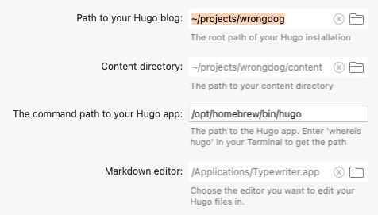

# Alfred Workflow - Hugo

## Introduction

This Workflow has been created to make it easier to create content for the [Hugo blogging system](https://gohugo.io/). With it you can add and edit content, start and stop the Hugo server and create properly formatted Dates for the frontmatter of your posts. 

## Requirements

One part of this Workflow requires Python 3 in order to run. This Workflow also requires Alfred 5 as well as the [Powerpack](https://www.alfredapp.com/powerpack/) in order to function.

The Workflow requires the [python-frontmatter library](https://pypi.org/project/python-frontmatter/) to determine which posts are in Draft format.

Additionally, you will need to have a [working and configured Hugo installation](https://gohugo.io/getting-started/quick-start/) prior to installing and running this Workflow.

## Installation

1. Download the Workflow
2. Double click the `.alfredworkflow` file
3. Follow the instructions to configure the Workflow

## Configuration

This workflow is a single entry point to multiple actions that you can perform to help make creating content with Hugo easier. This Workflow **requires** that Hugo has been installed and is working correctly. 

In order to run, the Workflow needs the following information:

1. The directory where your Hugo blog is installed
2. The content directory
3. The command line path to the Hugo executable. This is usually at `/opt/homebrew/bin/hugo`. You can use `whereis hugo` to get the path
4. The path to the Markdown editor that you will use to create and editor your content.

Alfred will ask for this data when you install the Workflow.

Once you have finished configuring the Workflow, you will need to edit the green List Filter object to include the content types in your blog. 

For each content type in your blog you need to create an entry (or edit the existing ones) that includes the Title and Subtitle as well as the **args** value. 

The Title and Subtitle are displayed in the Alfred command window and the **args** value is the name of the directory, in the `content` folder, that contains the posts for the content type.

The word `Posts` will show up in the Alfred window as a selectable option and the Arg `posts` is the name of the directory as well as the data that will be used later in the Workflow.

You are now ready to go. 

## Usage

In order to start the Workflow you need to activate Alfred and type the `Hugo` keyword. 

Select the Workflow from the list and then press Return. You will now be given a list of commands that are available in the Workflow.

Currently there are seven commands:

1. **Add**: Add a new file
2. **Edit**: Edit an existing file
3. **Start**: Start the Hugo server
4. **Start - drafts**: Start the Hugo server with --buildDrafts enabled
5. **Stop**: Stop the Hugo server
6. **Date**: Get a date in the Go format to use in the YAML frontmatter of content.
7. **Drafts**: List all of the content that are still Drafts

### Add

Select **Add** from the menu and Alfred will prompt you to select the type of content that you want to create.

The Workflow will then prompt you for a filename for your new file.

The workflow will send a command to Hugo to create the file in the appropriate directory and will then open the file with your chosen Markdown editor.

### Edit

Select **Edit** from the menu and Alfred will prompt you to select the type of content that you want to edit. This is the same list of options in the **Add** command. 

The Workflow will then build a list of your files in the appropriate directory and you can select the file that you want to edit. It will then be opened in the Markdown editor you selected in the Workflow Configuration. 

### Start

This command will start the Hugo server and open the default URL (localhost:1313) in your default browser.

### Start - draft

The same as the Start command but it will add the `--buildDrafts` flag to the server command to tell Hugo to render and serve any draft documents in your site. 

### Stop

Stop the Hugo server.

### Date

The command will create a string, with the current date and time, formatted to the date standard that Hugo uses. 

For example: `2023-03-22T11:11:07-06:00`

### Drafts

Select **Drafts** from the menu and Alfred will present the content type menu to let you select a post type to search. Once you select a type it will present a list of all the posts in that directory that are marked `draft: true`. You can then select a post to edit.

## Updates

### v1.0

The feature complete version. With bonus **Drafts** command.  Released June 27th, 2023.

#### Changes

* Added **Drafts** command to show any content that is still marked as a Draft post. 
* Fixed **Edit** command to run correctly.
* Actually fixed the **Start Server** command.
* Rewrote the Edit python code to use the Paths library.
* Added requirement to have the python-frontmatter library loaded. 

### v0.3

Released June 9th, 2023

#### Changes
* Fixed a problem with the **Start Server** command that was causing the Hugo server to not run correctly. 

